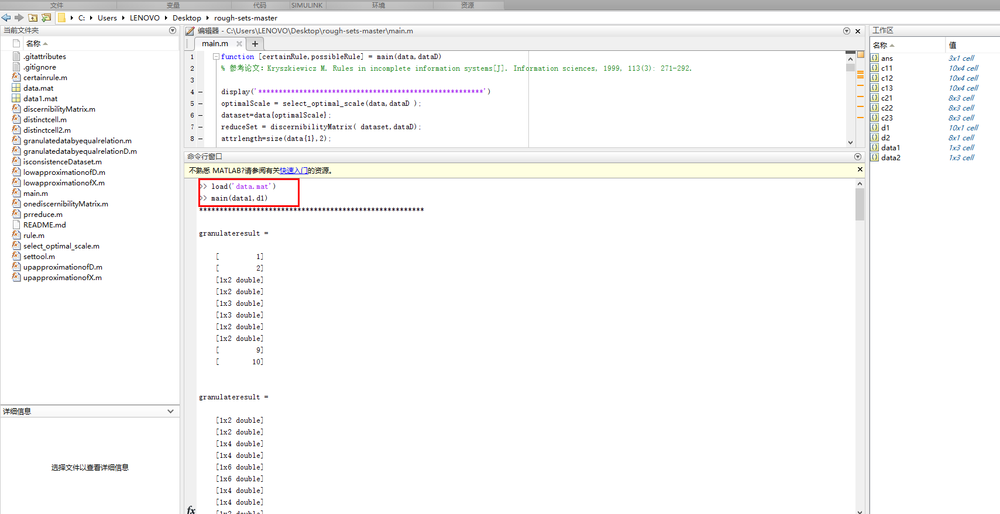

## [On rule acquisition in incomplete multi-scale decision tables](http://www.yuhuaqian.net/Cms_Data/Contents/SXU_YHQ/Folders/JournalPapers/~contents/ACD2ULGAC6VEMECB/On%20rule%20acquisition%20in%20incomplete%20multi-scale%20decision%20tables.pdf)
[Blind Face Restoration via Deep Multi-scale Component Dictionaries](https://arxiv.org/pdf/2008.00418.pdf)
This code for [On rule acquisition in incomplete multi-scale decision tables](www.yuhuaqian.net/Cms_Data/Contents/SXU_YHQ/Folders/JournalPapers/~contents/ACD2ULGAC6VEMECB/On%20rule%20acquisition%20in%20incomplete%20multi-scale%20decision%20tables.pdf)

#### running the code 

data.mat for Example 7 of this paper 

```
load('data.mat')
```
Decision values are saved by variable d1, conditional values are saved by variable data1.


```
main(data1,d1)
```


